# craftml


### What is a _craft_?

As a noun, we define a `craft` as a tool or a program that can generate 3D printable models. The technical defnition is _"a generator for parameteric 3D constructive solid geometries."_

### What is _CraftML_?

A markup language using an HTML-like syntax for defining a _craft_. One can use CraftML to define the individual parts of a model and the layout of these parts.

# Install

	$ npm install -g craft


# Hello World

__Design__

`helloworld.xml`

```html
<craft>
	Hello World
</craft>
```

__Preview__

	$ craft preview helloworld.xml
	
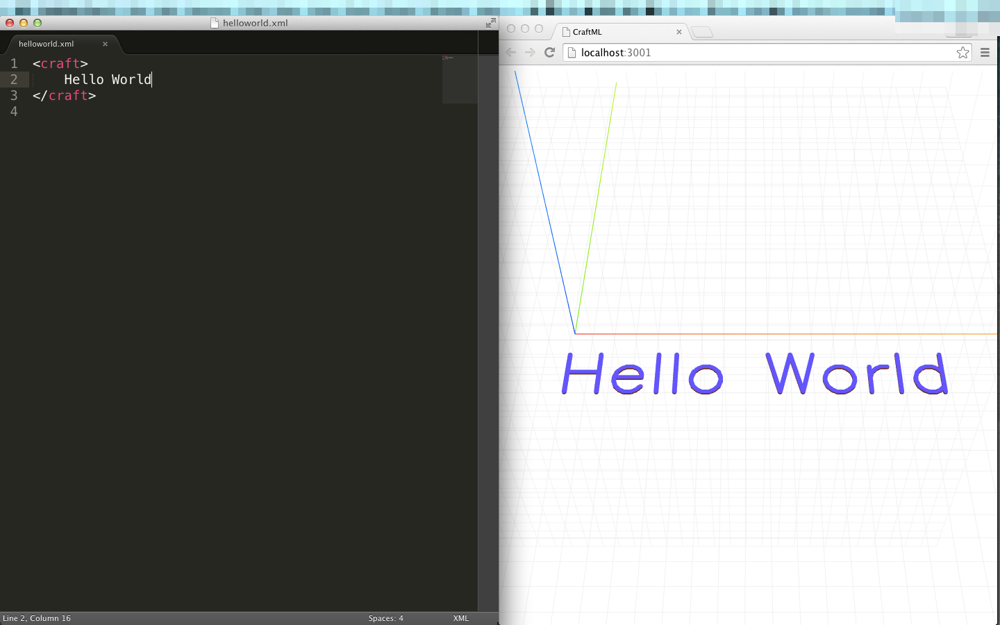


__Build__

	$ craft build helloworld.xml
	
It outputs `helloworld.stl`.
	
__Print__


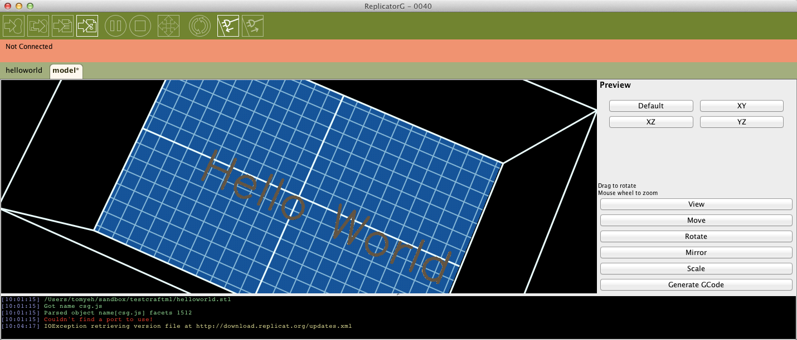


# Getting Started

## Coat Hanger

Let's craft a coat hanger with four pins on a flat borad. Luckily, we don't need to start from scratch. We can use existing crafts made by others to generate individual parts and use the _CraftML_ language to assemble these parts together into a coat hanger.  

Install the `craft-pin` and `craft-board` modules.

	$ npm install craft-pin	
	$ npm install craft-board

Create `hanger.xml` with the contents below.

```html
<craft>
	<craft name="pin" module="craft-pin"/>
	<craft name="board" module="craft-board"/>
	<board>
		<pin></pin>
		<pin></pin>
		<pin></pin>
		<pin></pin>
	</board>						
</craft>
```

Run `craft preview` to see the model in a web browser.

	$ craft preview hanger.xml
	
This command reads the contents of `hanger.xml`, builds a 3D model, opens up the default web browswer, and displays the model.

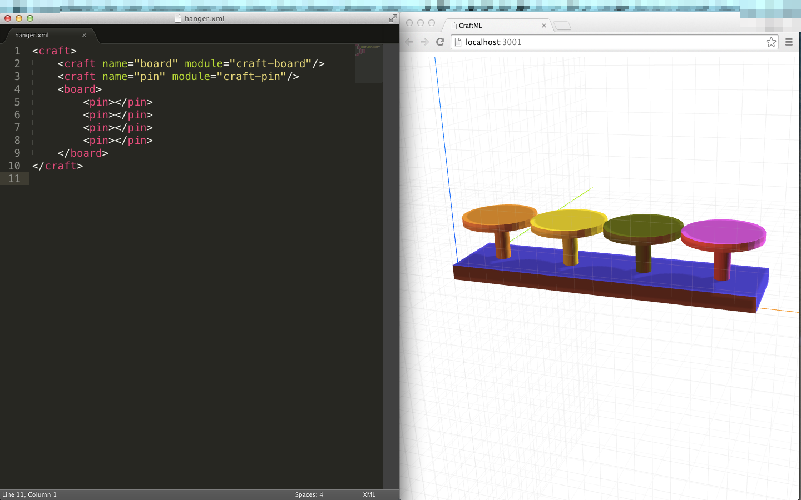

Let's add a couple more pins. The browser will automatically refreshes itself to dislay the updated model.

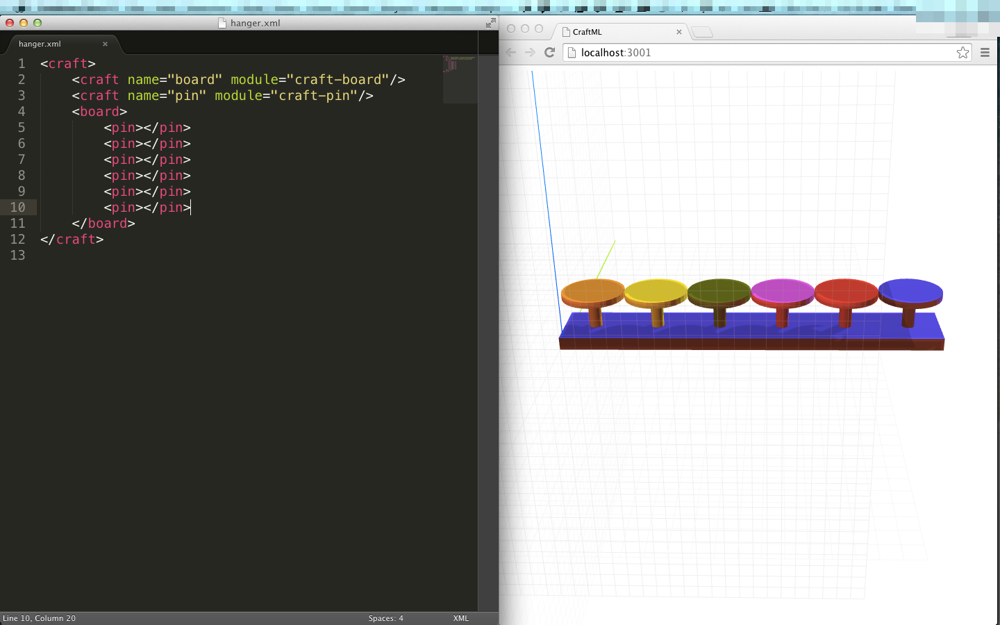

Once you are happy with the model, run `craft build` to build an _stl_ file that can be sent to a 3D printer.

	$ craft build hanger.xml

This command will produce `hanger.stl`. This is how the model looks like in [cura](https://ultimaker.com/en/products/software). 

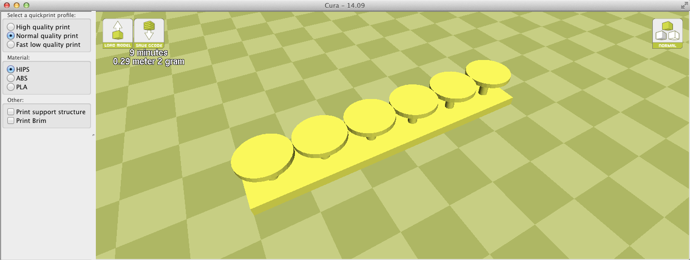

[Click here to view the model on Github](assets/hanger.stl)

## Stacking

We can stack things up using the `<stack>` tag.

```html
<craft>
	<craft name="pin" module="craft-pin"/>
	<craft name="board" module="craft-board"/>
	<board>
		<stack>
			<pin></pin>
			<pin></pin>
			<pin></pin>
			<pin></pin>
		</stack>
	</board>						
</craft>
```

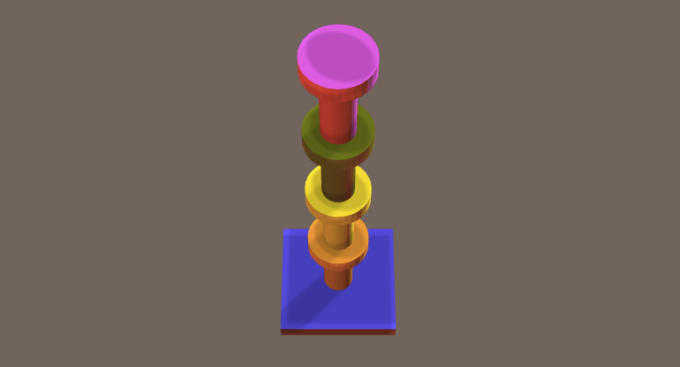

Four stacks of pins

```html
<craft>
	<craft name="pin" module="craft-pin"/>
	<craft name="board" module="craft-board"/>
	<board>
		<stack>
			<pin></pin>
			<pin></pin>
			<pin></pin>
			<pin></pin>
		</stack>
		<stack>
			<pin></pin>
			<pin></pin>
			<pin></pin>
		</stack>
		<stack>
			<pin></pin>
			<pin></pin>
		</stack>
		<stack>
			<pin></pin>
		</stack>		
	</board>						
</craft>
```

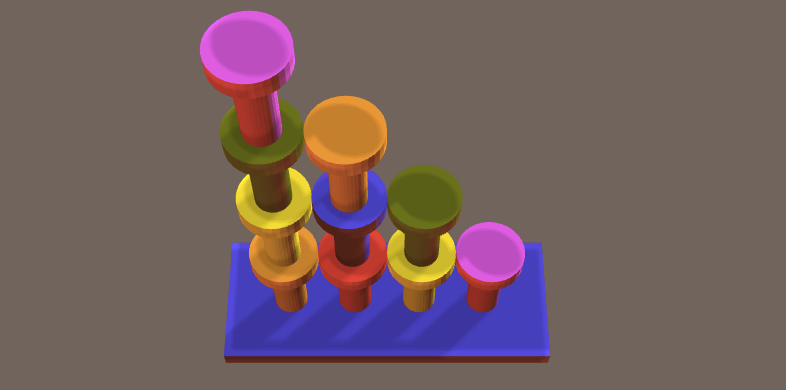

## Subcraft

* can be used to define a sub-component that can be reusable

```html
<craft>
	<craft name="pin" module="craft-pin"/>
	<craft name="board" module="craft-board"/>
	<craft name="tower">
        <stack>
            <pin></pin>
            <pin></pin>
            <pin></pin>
            <pin></pin>    
        </stack>
    </craft>
    <board>
    	<tower></tower>
        <tower></tower>
        <tower></tower>
        <tower></tower>
    </board>
</craft>
```
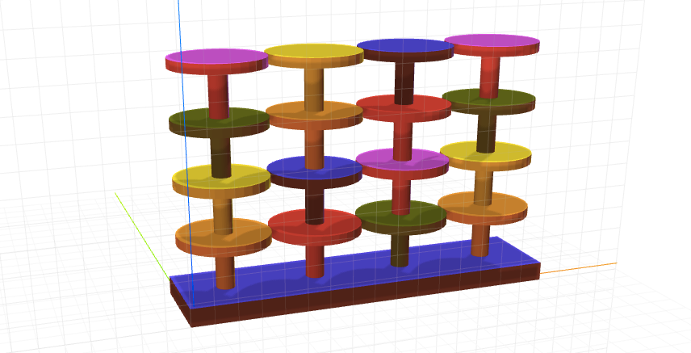


# Positioning

```html
<craft position="absolute">
    <cube x="-10" y="-5"></cube>    
    <cube x="10" y="5"></cube>    
    <cube x="20" y="10"></cube>
    <cube x="30" y="15"></cube>
</craft>
```

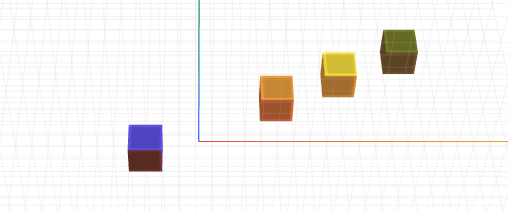


`<row>` causes the layout engine to ignore the _x_ values and arranges the four cubes tightly along the x-axs, while respecting the _y_ values.

```html
<craft position="absolute">
    <row>
	    <cube x="-10" y="-5"></cube>    
	    <cube x="10" y="5"></cube>    
	    <cube x="20" y="10"></cube>
	    <cube x="30" y="15"></cube>
    </row>
</craft>
```

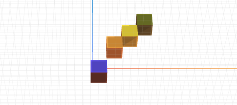

# Scripting

Write a function to generate CraftML tags

```html
<craft>
    <script type="text/craftml">
        function main(){
            return '<cube/><cube/><cube/><cube/><cube/>' 
        }
    </script>
</craft>
```

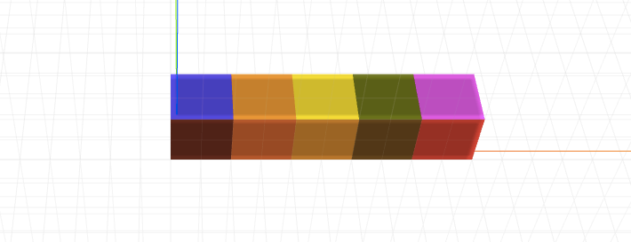

Define a subcraft to generate a row of cubes. _n_ is defined as a parameter to control how many cubes in the row.

```html
<craft>
    <craft name="ncubes">
        <parameter name="n" default="1" type="int"/>
        <script type="text/craftml">
            function main(params){
                var xml = ''
                for (var i = 0; i < params.n; i++){
                    xml = xml + '<cube/>'
                }                
                return xml
            }
        </script>
    </craft>
    <ncubes n="10"/>    
</craft>
```
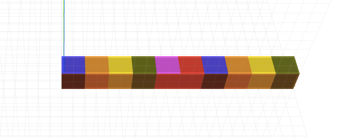

```html
<stack>
   <ncubes n="1"/>
   <ncubes n="3"/>
   <ncubes n="5"/>
   <ncubes n="7"/>    
</stack>
```

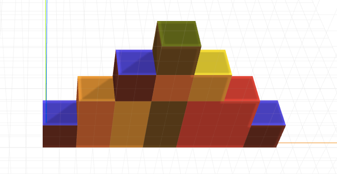

## Pyramid

```html
<craft>
    <craft name="pyramid">
        <parameter name="n" default="1" type="int"/>
        <script type="text/craftml">
            function main(params){
                var xml = '<stack>'
                for (var i = 1; i <= params.n; i++){
                    xml = xml + '<cube xsize="' + i + '" ysize="' + i + '" zsize="1"/>'
                }                
                xml = xml + '</stack>'
                return xml
            }
        </script>
    </craft>
    <stack>
        <pyramid n="5"/>          
    </stack>
</craft>
```

`main(params)` with `params.n` equal to 5 returns the following

```html
<stack>
	<cube xsize="1" ysize="1" zsize="1"/>
	<cube xsize="2" ysize="2" zsize="1"/>
	<cube xsize="3" ysize="3" zsize="1"/>
	<cube xsize="4" ysize="4" zsize="1"/>
	<cube xsize="5" ysize="5" zsize="1"/>
</stack>
```
which is rendered as

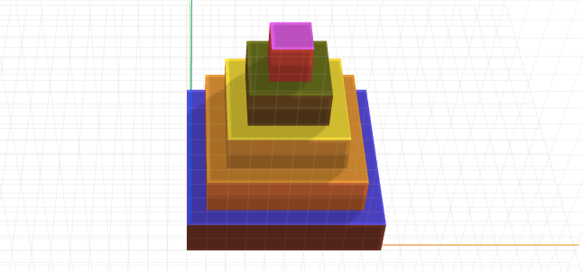

Let's stack a bunch of these pyramids.

```html
<stack>
   <pyramid n="3"/>
   <pyramid n="5"/>
   <pyramid n="7"/>
   <pyramid n="9"/>        
</stack>
```
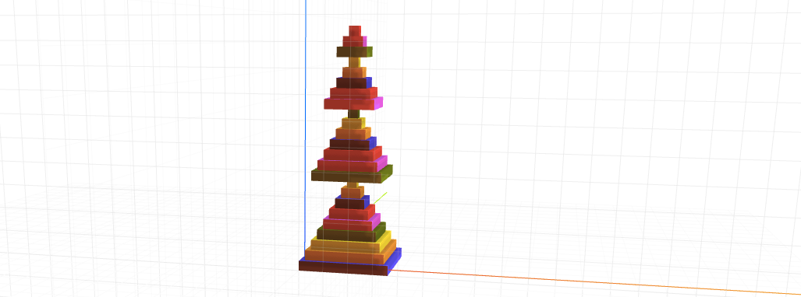

# Circle

```html
<craft position="absolute">
    <script type="text/craftml">
        function main(){
            var cubes = []
            var r = 30, n = 30, theta = 0
            var delta = 2 * Math.PI / n
            for (var i = 0; i < n; i++){                
                var x = r * Math.cos(theta)
                var y = r * Math.sin(theta)
                cubes.push('<cube x="' + x + '" y="' + y + '" size="2"/>')
                theta = theta + delta
            }                        
            return cubes.join('\n') 
        }                                        
    </script>
</craft>
```

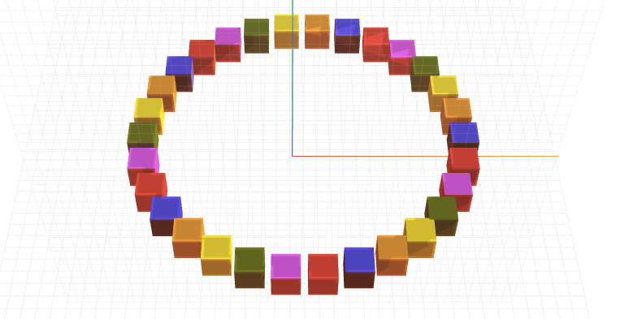

# Template Engines

```html
<craft>
    <craft name="pyramid">
        <parameter name="n" default="1" type="int"/>
        <script type="text/craftml">
            function main(params){
	            // compute a context object given 'params'
                var sizes = []
                for (var i = 1;i <= params.n; i++){
                    sizes.push(i)
                }
                // sizes = [1,2,3,...,n]
                var context = {sizes: sizes}
                return render(context)
            }                
                        
            // use a template engine to render craftxml given a context object
            function render(context) {
               // see different implmentations below
            }
        </script>
    </craft>
    <stack>
        <pyramid n="5"/>
    </stack>
</craft>
```


## Jade

[Jade](http://jade-lang.com/)

	$ npm install jade
	
```javascript
var jade = require("jade")

function render(context) {
    return jade.renderFile('./templates/pyramid.jade', context)
}
```

```jade
//- templates/pyramid.jade
stack
    each size in sizes
        cube(xsize=size, ysize=size, zsize=1)
```

## Markup.js

[Markup.js](https://github.com/adammark/Markup.js)

	$ npm install markup-js

```javascript
var Mark = require("markup-js")

function render(context) {
    var txt = fs.readFileSync('./templates/pyramid.markupjs', 'utf8')
    return Mark.up(txt, context)
}
```       

```html
<!-- templates/pyramid.markupjs -->
<stack>
{{sizes}}
    <cube xsize="{{.}}" ysize="{{.}}" zsize="1"/>
{{/sizes}}
</stack>
```    

## Lodash

	$ npm install lodash

```javascript
var _ = require("lodash"),
    fs = require("fs")

function render(context) {
    var txt = fs.readFileSync('./templates/pyramid.lodash', 'utf8')
    var compiled = _.template(txt)
    return compiled(context)
}
```

```html
<!-- templates/pyramid.lodash -->
<stack>
    <% _.forEach(sizes, function(size) { %>
        <cube xsize="<%- size %>"  ysize="<%- size %>" zsize="1"/>
    <% }); %>
</stack>
```

# OpenJSCAD

```html
<craft>
	<script type="text/openjscad">
		function main(){
			return cube()
		}
	</script>
</craft>
```

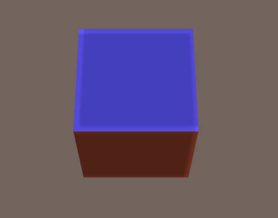

### Multiple Script Blocks
```html
<craft>
	<script type="text/openjscad">
		function main(){
			return cube()
		}
	</script>
	<script type="text/openjscad">
		function main(){
			return cube().scale([1,0.5,1])
		}
	</script>	
</craft>
```

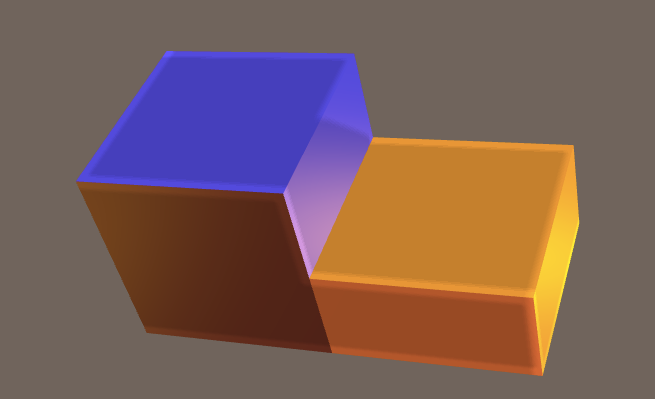


### Nested Crafts

A craft can be nested in another craft. This is especially useful for generating repeated parts.

Suppose we want to generate a cube and repeat it four times. We can define a nested craft called `cube` that uses a script to generate a cube. Then, we can write four `<cube>` tags to create four cubes.

```html
<craft>
	<craft name="mycube">
		<script type="text/openjscad">
			function main(){
				return cube()
			}
		</script>
	</craft>
	<mycube></mycube>
	<mycube></mycube>
	<mycube></mycube>
	<mycube></mycube>
</craft>
```

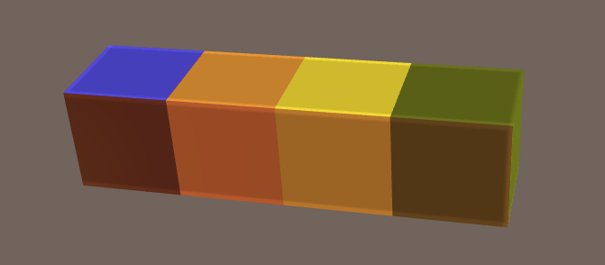

### Include

We can refactor the previous example by extracting the contents of `<craft name="mycube">` and save them to another file called `mycube.xml`.

`mycube `:

```html
<craft>
	<script type="text/openjscad">
		function main(){
			return cube()
		}
	</script>
</craft>
```

We can now reuse `mycube.xml` to craft as many cubes as we want.

```html
<craft>
	<craft name="mycube" src="./mycube.xml"/>
	<mycube></mycube>
	<mycube></mycube>
	<mycube></mycube>
	<mycube></mycube>
</craft>

```


## Parameters

The `<parameter>` tag can be used to introduce a parameter to a craft. 

`cube.xml`:

```html
<craft>
	<parameter name="height" type="int" default="1"/>
	<script type="text/openjscad">
		function main(params){
			return cube().scale([1,params.height,1])
		}
	</script>	
</craft>
```
In this example, the `height` parameter is introduced to allow us to easily craft cubes with different heights. The `default` attribute indicates that the default height is `1`.  The `type` attribute indicates that the parameter is an integer. 

Valid parameter types are: 

* `int`
* `string` 
* `float`.

This example crafts four cubes with increasing heights.

```html
<craft>
	<craft name="mycube" src="./mycube.xml"/>
	<mycube></mycube>
	<mycube height="2"></mycube>
	<mycube height="3"></mycube>
	<mycube height="4"></mycube>
</craft>
```

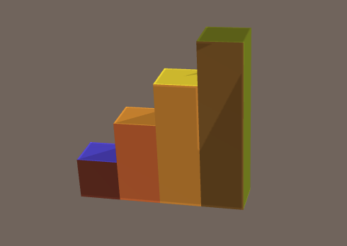

# API

```javascript
var craft = require('craft')

var xml = '<craft>hello world</craft>'

var result = craft.render(xml)
console.log(result.toStl())

```

### Async
```javascript
var result = craft.render(xml, function(error, result){
	if (error)
		throw error
	console.log(result.toStl())
})
```

### Pipe
```javascript
craft.render(xml)
	 .pipe(craft.csg2stl())
	 .pipe(fs.createWriteStream('output.stl'))
```

### Parameters

```javascript
var result = craft.render(xml, {height: 5}, function(error, result){
	console.log(result.toStl())
})
```

`var xml = `

```html
<craft>
	<parameter name="height" type="int" default="1"/>
	<script type="text/openjscad">
		function main(params){
			return cube().scale([1,params.height,1])
		}
	</script>	
</craft>
```

In `main(params)`, `params` is resolved to 5.